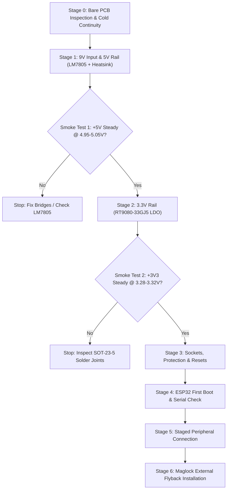

# MACHIP 3.0 Hardware Assembly & Power Supply Bring-Up Guide

**Board:** MACHIP 3.0 Access Control Terminal  
**Schematic:** [`MACHIP3.0.kicad_sch`](file:///home/achyllisss/Documents/ELECTRONICS/MACHIP3.0/MACHIP3.0.kicad_sch)  
**PCB Layout:** [`MACHIP3.0.kicad_pcb`](file:///home/achyllisss/Documents/ELECTRONICS/MACHIP3.0/MACHIP3.0.kicad_pcb)  
**Production Archive:** [`MACHIP3.0_JLCPCB_READY.zip`](file:///home/achyllisss/Documents/ELECTRONICS/MACHIP3.0/MACHIP3.0_JLCPCB_READY.zip)  
**Document Purpose:** Staged bench assembly protocol to ensure zero blown ICs, zero short circuits, and 100% verified voltage rails before inserting the microcontroller or peripherals.

---

## The Golden Rule of Hardware Bring-Up

> [!CAUTION]
> **NEVER populate the entire board at once!**  
> If an LDO regulator is bridged, backward, or defective, it will dump 9V directly into the ESP32 and display controllers, destroying hundreds of dollars of silicon in microseconds.  
> **Always solder the power supply first, verify voltages and thermal stability with a multimeter, and only then proceed stage-by-stage.**

---

## Overview of the 6 Bring-Up Stages

---

## Stage 0: Bare PCB Inspection (Cold Checks Before Soldering)

*Tools required: Digital Multimeter (DMM) in Resistance ($\Omega$) and Continuity (Beep) mode.*

1. **Visual Inspection:**
   * Inspect the bare PCB under good lighting or a magnifying glass. Check that the solder mask is clean, mounting holes `H1`–`H4` have clean edges, and there are no manufacturing copper scratches.
2. **Ground Plane Continuity:**
   * Put one multimeter probe on `TP_GND1` (bottom right).
   * Probe the ground pins of `J1`, `U1.2`, `U2.14`, and all mounting hole rings.
   * **Result:** Must beep ($< 0.5\,\Omega$).
3. **Power Rail Isolation (No Factory Shorts):**
   * Red probe on **`TP_9V1`** $\longleftrightarrow$ Black probe on **`TP_GND1`**: Must read **Open Circuit / Infinite resistance ($> 1\,\text{M}\Omega$)**.
   * Red probe on **`TP_5V1`** $\longleftrightarrow$ Black probe on **`TP_GND1`**: Must read **Open Circuit ($> 1\,\text{M}\Omega$)**.
   * Red probe on **`TP_3V3`** $\longleftrightarrow$ Black probe on **`TP_GND1`**: Must read **Open Circuit ($> 1\,\text{M}\Omega$)**.

---

## Stage 1: Power Input & 5V Regulator Bring-Up

In this stage, you build **only** the 9V protection front-end and the 5V linear regulator.

### 1. Components to Solder in Stage 1
* [ ] **`J1`**: DC Barrel Jack ($2.0\text{mm} \times 2.1\text{mm}$)
* [ ] **`F1`**: Resettable PTC Fuse (`RXEF110`, 1.1A hold)
* [ ] **`D2`**: Bidirectional TVS Surge Diode (`SMBJ10CA`, SMB package)
* [ ] **`Q1`**: P-Channel Reverse Polarity MOSFET (`AO3401`, SOT-23 package)
* [ ] **`D1`**: Zener Protection Diode (`BZT52C10`, SOD-123 package)
* [ ] **`C1`**: $100\,\mu\text{F}$ 25V/35V Radial Bulk Electrolytic Capacitor *(Observe positive "+" square pad!)*
* [ ] **`C2`**: $1\,\mu\text{F}$ Ceramic Disc Capacitor
* [ ] **`U1`**: LM7805 Linear Regulator (TO-220-3) **WITH HEATSINK BOLTED ON** *(Use thermal compound)*
* [ ] **`C3`**: $100\,\text{nF}$ Ceramic Disc Capacitor (Output filter)
* [ ] **`C4`**: $10\,\mu\text{F}$ Radial Electrolytic Capacitor (Output bulk)
* [ ] **Test Points:** `TP_9V1`, `TP_5V1`, `TP_GND1`

> [!WARNING]
> **DO NOT** install `U2` (ESP32), `U3` (RT9080), or any other ICs yet!

### 2. Smoke Test 1 Protocol
1. Set bench power supply or regulated 9.0V adapter to **9.0V DC**.
2. Plug the barrel jack into `J1`.
3. **Immediate Thermal & Smell Check (First 5 seconds):**
   * Keep your finger gently touching `U1` (LM7805) and `D2`. If anything feels instantly hot, unplug immediately!
4. **Voltage Measurements (Multimeter in DC Volts):**
   * Black probe on **`TP_GND1`**:
     * Probe **`TP_9V1`**: Must read **$8.85\,\text{V} \text{ to } 9.15\,\text{V}$**.
     * Probe **`TP_5V1`**: Must read **$4.92\,\text{V} \text{ to } 5.08\,\text{V}$**.
5. **Standby Stability Burn-In (5 Minutes):**
   * Leave the 9V power connected for 5 minutes.
   * Re-check `TP_5V1`: Voltage must remain rock-solid within $\pm 0.05\,\text{V}$.
   * The LM7805 heatsink should feel barely warm (idle quiescent current is only $\approx 5\text{--}8\,\text{mA}$).
6. **Pass Criteria:** If `TP_5V1` reads $5.00\,\text{V} \pm 2\%$, unplug power. Stage 1 is certified!

---

## Stage 2: 3.3V Low-Dropout Regulator Bring-Up

Now bring up the sensitive 3.3V logic supply rail.

### 1. Components to Solder in Stage 2
* [ ] **`U3`**: LDO Voltage Regulator (`RT9080-33GJ5`, SOT-23-5)
  * *Pin 1:* VIN (+5V)
  * *Pin 2:* GND
  * *Pin 3:* EN (+5V)
  * *Pin 4:* NC
  * *Pin 5:* VOUT (+3.3V)
* [ ] **`C5`**: $100\,\text{nF}$ Ceramic Disc (Input bypass)
* [ ] **`C6`**: $10\,\mu\text{F}$ Radial Electrolytic (Output bulk)
* [ ] **`C7`**: $100\,\text{nF}$ Ceramic Disc (High-frequency output bypass)
* [ ] **Test Point:** `TP_3V3`

### 2. Smoke Test 2 Protocol
1. Plug in the 9.0V barrel supply.
2. Probe **`TP_3V3`** against **`TP_GND1`**:
   * **Required Reading:** **$3.27\,\text{V} \text{ to } 3.33\,\text{V}$**.
3. **Failure Flag:** If `TP_3V3` reads $> 3.45\,\text{V}$ or $0\,\text{V}$, immediately cut power. Check for solder bridges between SOT-23-5 Pins 1 and 5.
4. **Pass Criteria:** Both the 5.0V bus and 3.3V bus are verified healthy. Unplug power.

---

## Stage 3: Passives, Protection Arrays, and Sockets

### 1. Components to Solder in Stage 3
* [ ] **`U2` Sockets:** Solder **TWO 19-pin female header strips** (`C319202`) for the ESP32 DevKit. *(Do NOT solder the ESP32 directly to the PCB; always use sockets!).*
* [ ] **Reset & Pull-Up Network:**
  * `R3` ($10\,\text{k}\Omega$): Pull-up on ESP32 EN pin
  * `C9` ($100\,\text{nF}$): Hardware debouncing cap on ESP32 EN
  * `R1`, `R2`, `R4`, `R5`, `R6`, `R7`, `R11`, `R15`, `R17` ($10\,\text{k}\Omega$ axial resistors)
* [ ] **ESD Diode Arrays:**
  * `U4` (`ESDSRV05-4`, SOT-23-6)
  * `U5` (`ESDSRV05-4`, SOT-23-6)
* [ ] **SPI Damping Resistors:**
  * `R9` ($22\,\Omega$): Series damping on SPI SCK
  * `R18` ($22\,\Omega$): Series damping on SPI MOSI
  * `R19` ($22\,\Omega$): Series damping on SPI MISO
* [ ] **Peripheral Bulk Capacitors:**
  * `C16` ($100\,\mu\text{F}$): Outside TFT bulk
  * `C17` ($100\,\mu\text{F}$): Fingerprint Sensor bulk
  * `C20` ($100\,\mu\text{F}$): Inside TFT bulk
  * `C10`, `C12`, `C14`, `C18`, `C21` ($10\,\mu\text{F}$ decoupling)
  * `C8`, `C11`, `C13`, `C15`, `C19`, `C22` ($100\,\text{nF}$ decoupling)
* [ ] **Test Points:** `TP_EN1`, `TP_SCK1`, `TP_FPTX1`, `TP_RELAY1`

### 2. Socket Cold & Live Verification
Before inserting the ESP32 into `U2`:
1. Power up board with 9V.
2. Probe the female socket holes of `U2`:
   * **Pin 19 (`VIN`):** Must measure **$5.00\,\text{V}$**.
   * **Pin 1 (`3V3`):** Must measure **$3.30\,\text{V}$**.
   * **Pin 2 (`EN`):** Must measure **$3.30\,\text{V}$** (pulled high by `R3`).
   * **Pins 14, 20, 26 (`GND`):** Must measure **$0.00\,\text{V}$**.
3. **Turn OFF power.**

---

## Stage 4: Microcontroller (ESP32) First Boot

1. **Orientation Check:**  
   Align the ESP32 DevKit module so the **micro-USB / Type-C connector faces outward** towards the board edge, matching the silkscreen outline.
2. Carefully press the ESP32 pins into the two 19-pin female header sockets. Ensure no pins fold or miss the socket holes.
3. **First Power-Up with MCU:**
   * Plug in the 9.0V barrel power supply.
   * Observe the red power LED on the ESP32 board illuminate.
   * Connect a USB cable from your laptop to the ESP32 USB port.
   * Open Arduino IDE / VSCode PlatformIO Serial Monitor at `115200` baud.
   * Press the physical EN/RST button on the ESP32.
   * You should see the standard ESP32 ROM boot log:  
     `rst:0x1 (POWERON_RESET),boot:0x13 (SPI_FAST_FLASH_BOOT)...`
4. Upload a basic test script (LED blink or Wi-Fi scan) to verify flash programming.

---

## Stage 5: Output Drivers (Relay & Buzzer)

* [ ] **`Q2`**: NPN Transistor (`PN2222A` / `2N2222A`, TO-92)
* [ ] **`R14`, `R16`**: $1\,\text{k}\Omega$ base drive resistors
* [ ] **`R8`**: $68\,\Omega$ resistor
* [ ] **`R10`**: $100\,\Omega$ audio current-limiting resistor
* [ ] **`R12`, `R13`**: $220\,\Omega$ status LED resistors
* [ ] **`D3`, `D4`**: JST-XH 2-Pin connectors (Red and Green status LED cables)
* [ ] **`J7`**: JST-XH 3-Pin connector (Buzzer Module)
* [ ] **`J8`**: JST-XH 3-Pin connector (Relay Module)

---

## Stage 6: Staged Peripheral Connection & Testing

Connect peripherals **one by one**, never all at once:

| Step | Peripheral | Header | Verification Action | Pass Criteria |
|:---:|:---|:---:|:---|:---|
| **1** | **Fingerprint Sensor** | `J6` (4-Pin) | Power on terminal. Optical sensor should flash blue/red. Run UART fingerprint test code. | ESP32 receives ACK packets on `FP_RX`. |
| **2** | **Inside RFID Reader** | `J2` (7-Pin) | Tap an RFID keyfob on MFRC522 reader. | Serial monitor displays tag UID. |
| **3** | **Outside RFID Reader** | `J3` (7-Pin) | Tap an RFID keyfob on outdoor reader. | Serial monitor displays tag UID. |
| **4** | **Inside TFT Display** | `J5` (9-Pin) | Initialize ST7789 display driver via SPI. | Display renders test color bars. |
| **5** | **Outside TFT Display** | `J4` (9-Pin) | Initialize second ST7789 display driver. | Display renders UI screen. |
| **6** | **Reset Decoupling Test** | Code | Pulse GPIO27 low (`RFID_Resets`) while holding both TFT displays active. | RFID reader resets; **TFT screens remain rock solid without flickering or blanking!** |

---

## Stage 7: Magnetic Lock & Field Wiring Safety

> [!IMPORTANT]
> **Flyback Diode Mounting Location:**  
> When wiring the 12V magnetic door lock to the relay contacts (`J8`), you **MUST** install a **`1N4007`** axial diode directly across the magnetic lock screw terminals:
> * **Cathode (banded end)** $\longrightarrow$ Lock **`+12V`** screw terminal.
> * **Anode (unbanded end)** $\longrightarrow$ Lock **`GND / Negative`** screw terminal.
> 
> *Never place this diode back on the PCB—it must be physically on the lock body to trap the inductive kickback at the source!*

---

## Quick Reference Test Point Voltage Table

Keep this table next to your multimeter during assembly:

| Test Point | Net Name | Expected Voltage | Tolerance Range | Function |
|:---:|:---:|:---:|:---:|:---|
| **`TP_GND1`** | `GND` | **$0.00\,\text{V}$** | Reference | Multimeter ground clip connection |
| **`TP_9V1`** | `Net-(D1-K)` | **$+9.00\,\text{V}$** | $8.85\text{--}9.15\,\text{V}$ | 9V DC input post-fuse & MOSFET |
| **`TP_5V1`** | `+5V` | **$+5.00\,\text{V}$** | $4.92\text{--}5.08\,\text{V}$ | LM7805 regulated 5V power bus |
| **`TP_3V3`** | `+3V3` | **$+3.30\,\text{V}$** | $3.27\text{--}3.33\,\text{V}$ | RT9080 regulated 3.3V logic bus |
| **`TP_EN1`** | `Net-(U2-EN)`| **$+3.30\,\text{V}$** | $3.25\text{--}3.30\,\text{V}$ | ESP32 hardware enable pull-up |
| **`TP_SCK1`** | `SCK` | **$0.00\text{--}3.30\,\text{V}$** | Square wave on scope | SPI bus master clock signal |
| **`TP_FPTX1`**| `FP_TX` | **$+3.30\,\text{V}$** (Idle) | Dips during transmit | ESP32 UART transmit to sensor |
| **`TP_RELAY1`**| `RELAY_IN2` | **$0.00\,\text{V}$** (Off) / **$3.30\,\text{V}$** (On) | Digital output | ESP32 relay actuation trigger |
